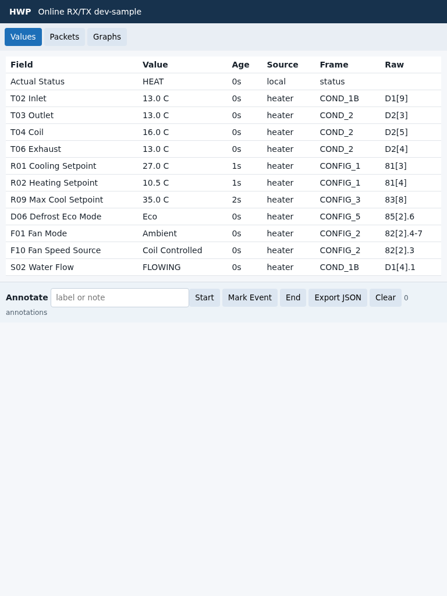

# HWP Analysis Tools

The analysis tools support field discovery without turning the firmware web UI
into a heater-control surface. The quickest field workflow is:

1. Flash a test device with ESPHome `web_server:` and HWP `web_ui.enabled: true`.
2. Open `http://<device-address>/hwp` from a tablet.
3. Use **Values** for decoded fields, **Packets** for recent bus traffic, and
   **Graphs** for trends.
4. Use the **Annotate** controls to mark the start/end of a menu action or an
   observed event.
5. Export the browser-local JSON annotations after the field session, then
   convert only useful evidence into tracked fixtures.



Regenerate captures from a live device with:

```sh
python -m analysis.hwp_web_capture \
  --base-url http://<device-address>/hwp \
  --out-dir analysis/screenshots \
  --readme-size tablet
```

The command captures phone, tablet, and desktop media sizes by default. The
README intentionally references only the tablet capture.

## Identification Backlog

Use [docs/protocol/research-backlog.md](../docs/protocol/research-backlog.md)
as the source of truth for unknown or uncertain packet fields. The web UI can
help gather evidence for those items:

- Compare packet changes while navigating read-only technical menus.
- Warm or cool suspected temperature sensors gently by hand or with an ice pack,
  then watch the Values, Packets, and Graphs tabs for correlated changes.
- Change safe writable menu values one at a time and capture command/echo
  windows with **Start** and **End** annotations.
- Observe pump, flow, defrost, and idle/running transitions only when the system
  is already operating normally.
- For alarm/status research, only qualified humans should isolate power before
  disconnecting low-voltage sensors or connectors from the main board. Never
  work on live mains or refrigerant equipment, never bypass safety devices, and
  stop immediately if the heater enters an unsafe state.

Keep full field exports and raw captures local unless they are curated into a
small fixture or a focused protocol note.
