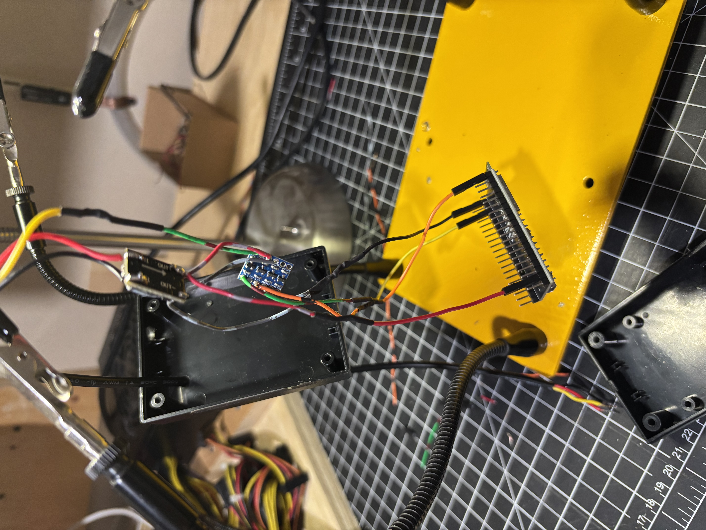
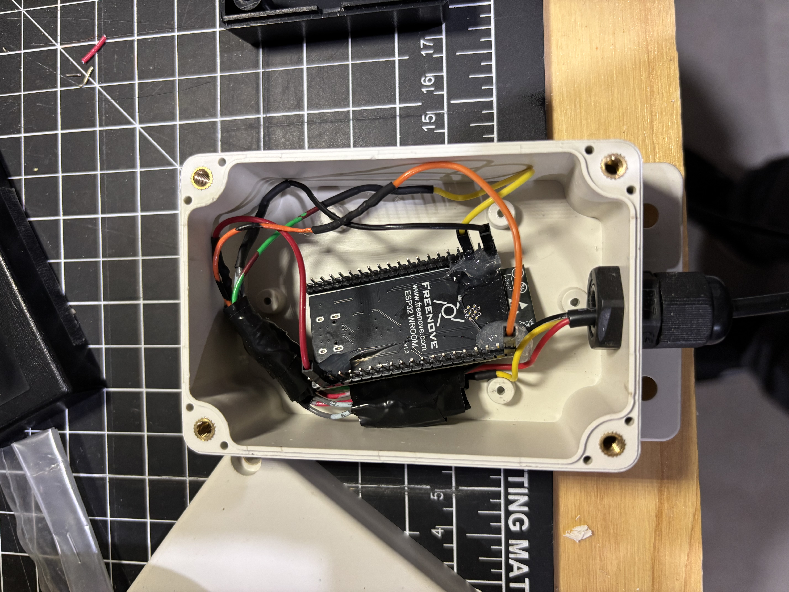
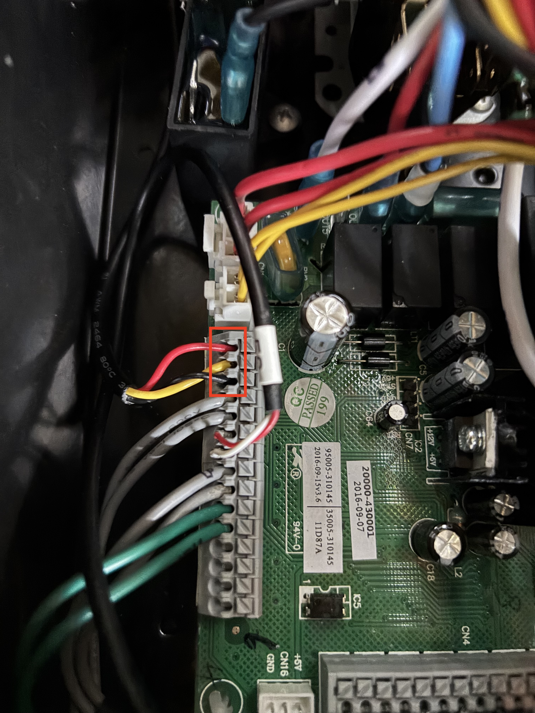
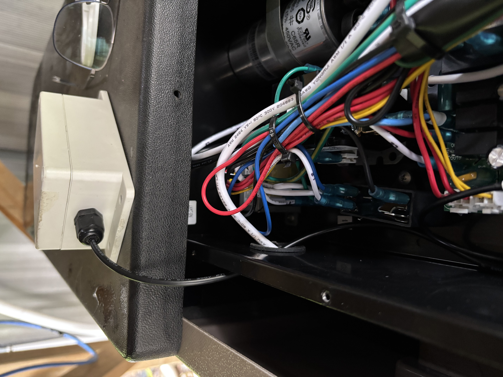
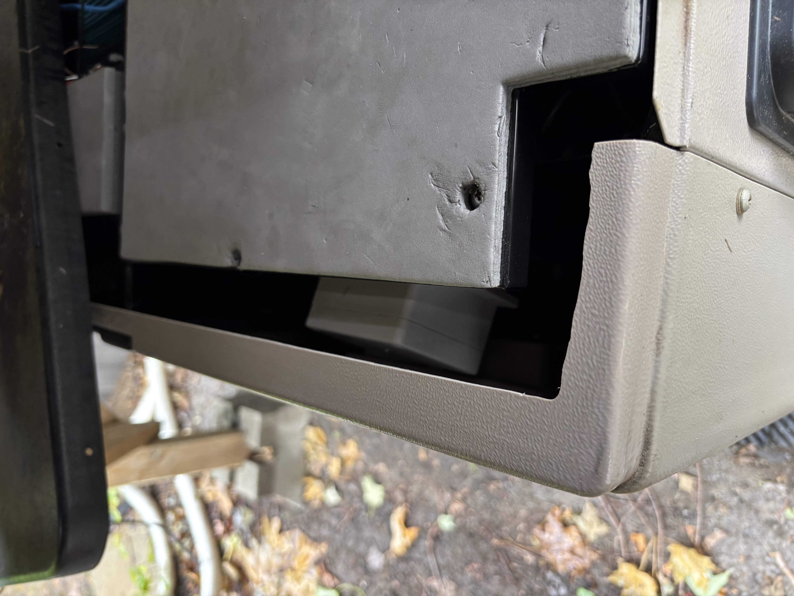
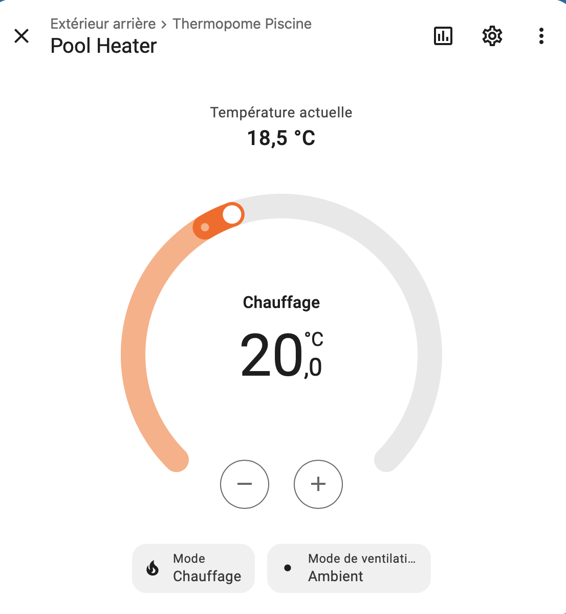

# HP55TR E08 Bypass And Home Assistant Control

Source: [GitHub discussion #9, "Hayward HP55TR Success Story - Bypassed E08 error"](https://github.com/sle118/hayward_pool_heater/discussions/9)

In July 2025, community member `mvallee2181` reported an intermittent `E08` communication fault on a Hayward HP55TR. The reported failure mode was loss of communication between the original user interface and the main board. By August 2025, they reported that this ESPHome component allowed the heat pump to keep working without the original panel path and also made remote control possible through Home Assistant.

The shared build used:

- Hayward HP55TR heat pump with a PC1000 board.
- ESP32.
- 4-channel bidirectional I2C logic level shifter.
- DC-DC buck converter for stepping the heat pump supply down for the ESP32 side.

This is a community success report, not a generalized safety guarantee. Treat the photos as one implementation example and continue to follow the project hardware notes, voltage-level requirements, and manual validation procedures.

## Bench Wiring

## HP55TR PC1000 Connection

The contributor identified the connection point on the HP55TR PC1000 board and highlighted the relevant terminals in the discussion photo.

## Enclosure And Cable Routing

The installation placed the ESP32-side electronics in a small external enclosure with cable routing back into the heat pump cabinet.

## Home Assistant Result

The reported result was a Home Assistant climate entity exposing current temperature, heat setpoint, HVAC mode, and fan mode.

## Why This Matters

This report is valuable because it exercises the project in a failure mode that originally motivated the user: intermittent controller communication errors. It also gives future users a concrete PC1000/HP55TR example with photos of the board connection, the level-shifted ESP32 wiring, the physical enclosure, and the Home Assistant surface.

For project governance, this story should remain documentation evidence only. It should not be used as a protocol fixture or as proof that new active-control changes are safe without the normal compile, native, fixture, and manual hardware-in-the-loop checks.

